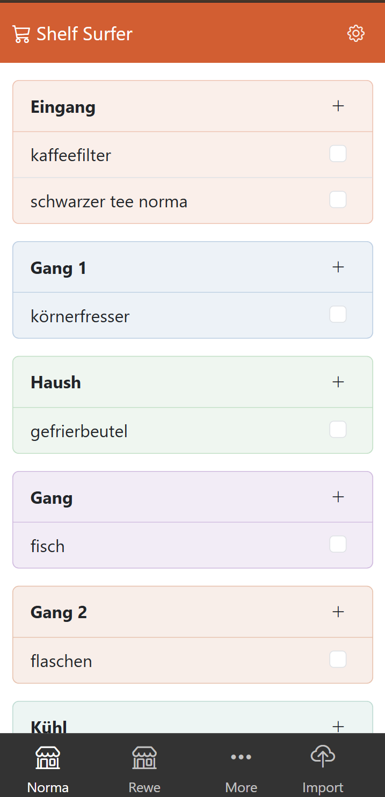

# ShelfSurfer

An older version of this enabled me doing groceries with a long list in 2 places inclding 2 times checkout in 30 min. Version 2 ...

- Setup data/default_user/places.yml (place / sub -> buying and synonyms)
- Capture things using Alexa lists (most easy)
- Export as text, import here (Alexa rest API is deprecated)
- Automatically sorted by sub section where you buy it

See the ~5 items that you need to get where you stand. Much faster than running back and forth while doing groceries or scrolling through a long list multiple times.

Added a print version of the list, use in case you don't want to risk your smartphone

**State:** usable

## Demo

LICENSE
----------------------------------------------------------

Copyright (C) Walter A. Jablonowski 2025, free under [MIT License](LICENSE)

This app is build upon PHP and free software (see [credits](credits.md))

[Privacy](https://walter-a-jablonowski.github.io/privacy.html) | [Legal](https://walter-a-jablonowski.github.io/imprint.html)
